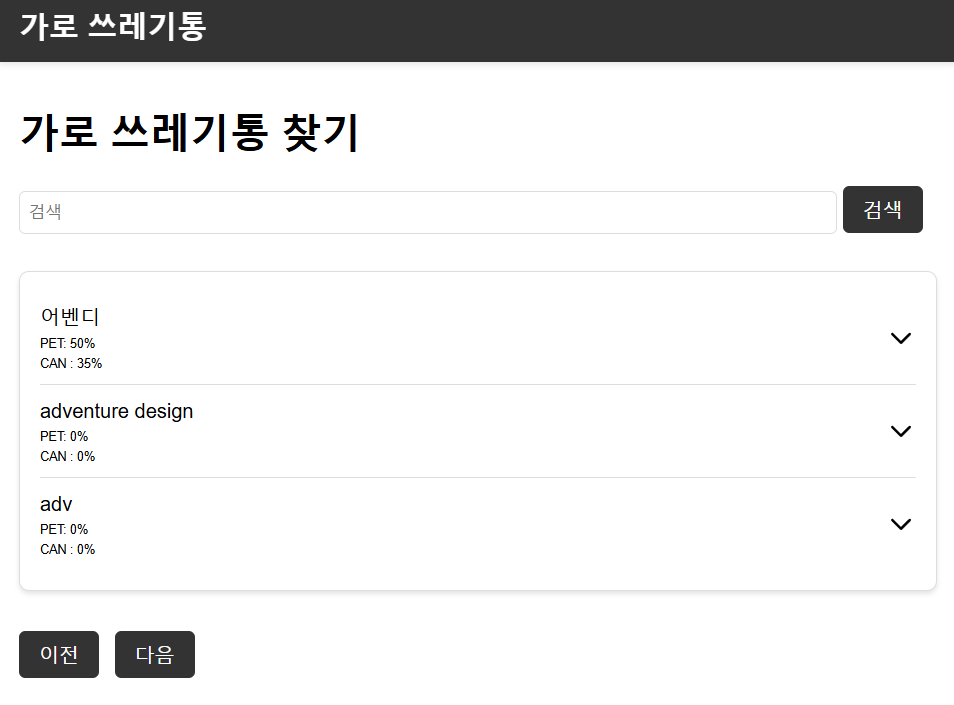

# smart trashbin web server


[smart trashbin](https://github.com/yuyeol3/smart-trashbin)의 데이터 저장 및 조회를 처리하기 위한 웹서버입니다.

## 주요 기능
- 쓰레기통 상태 조회 및 검색 기능
    - 현재 쓰레기통의 상태를 확인
    - 검색을 통해 원하는 쓰레기통 조회 가능
- 쓰레기통 관리 기능
    - 관리자 계정을 통해 로그인
    - 쓰레기통 추가/삭제/수정
    - 관리자 등록

## 사용한 기술
- express.js
    - passport
    - nunjucks
- mysql

## 프로젝트 구조

```
smart-trashbin/
├── controllers/          # 요청 핸들러 (auth.js, trashbin.js 등)
├── services/             # 비즈니스 로직
├── models/               # 데이터베이스 모델 정의
├── middlewares/          # 미들웨어 (auth.js 등)
├── routes/               # 라우팅 설정
├── views/                # 템플릿 파일 
├── config/               # 설정 파일 (config.json 등)
├── public/               # 정적 파일 (CSS, JS, 이미지)
├── app.js                # 애플리케이션 진입점
├── .env                  # 환경 변수 파일
└── adventure_design.sql  # SQL 데이터베이스 초기화 스크립트
```